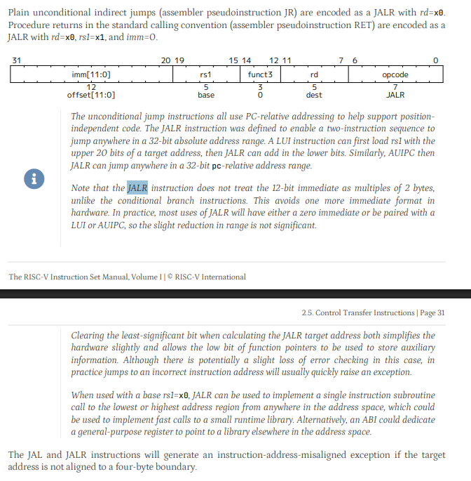
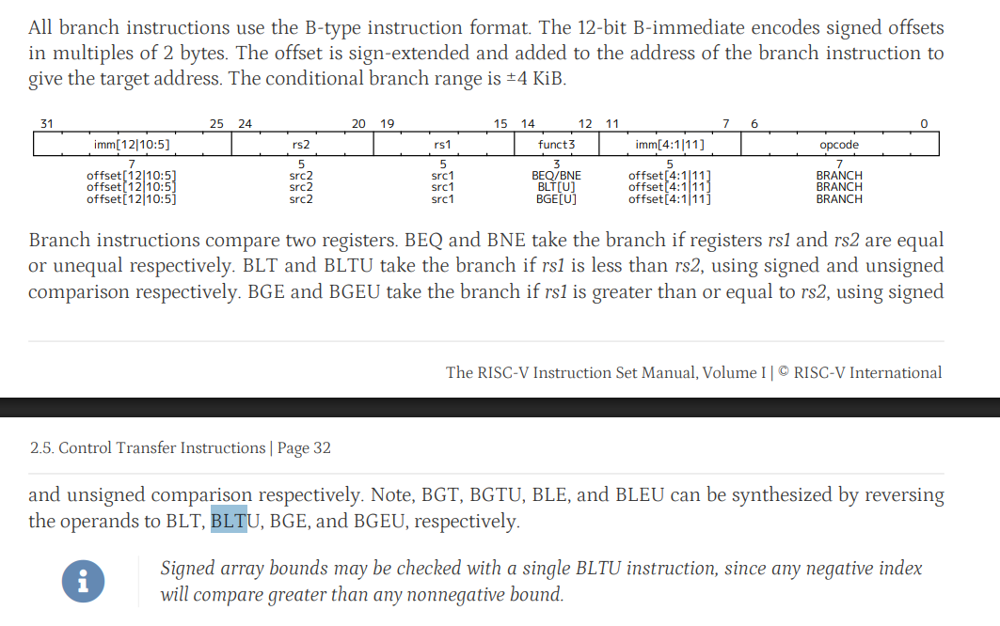
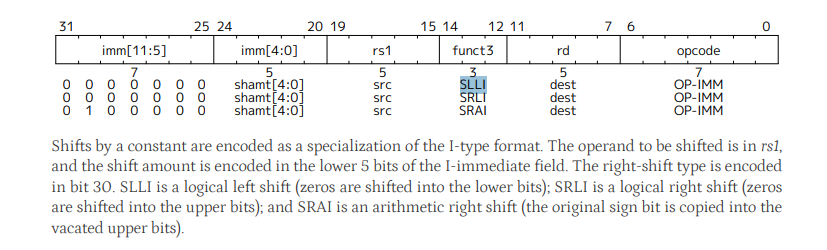
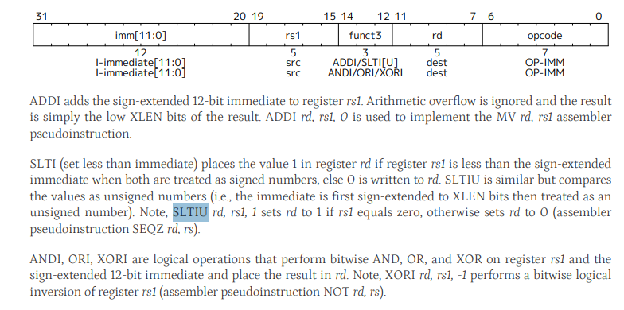

# programinha teste soma 1

0x00000000	0x00002083	LW x1, 0(x0)	LW x1, 0(x0)
0x00000004	0x001081b3	ADD x3, x1, x1	ADD x3, x1, x1
0x00000008	0x00302223	SW x3, 4(x0)	SW x3, 4(x0)

00002083
001081b3
00302223

código SLLI (funcional)
00002083 00309113 00202223    

## sinais de controle (Bloco de controle)
| instrução     | OPCODE         | funct3    | funct7 | J_inst | RegWrite | ALUSrc | MemWrite | ALUOp1 | ALUOp0 | MemToReg | MemRead | Branch |
|---------------|----------------|-----------|:------:|:------:|:--------:|:------:|:--------:|:------:|:------:|:--------:|:-------:|:------:|
| LW            | 0000011 (0x03) | 0x2       |   X    |   0    |    1     |   1    |    0     |   0    |   0    |    1     |    1    |   0    |
| SW            | 0100011 (0x23) | 0x2       |   X    |   0    |    0     |   1    |    1     |   0    |   0    |    0     |    0    |   0    |
| ADD           | 0110011 (0x33) | 0x0       |  0x00  |   0    |    1     |   0    |    0     |   1    |   0    |    0     |    0    |   0    |
| SUB           | 0110011 (0x33) | 0x0       |  0x20  |   0    |    1     |   0    |    0     |   1    |   0    |    0     |    0    |   0    |
| AND           | 0110011 (0x33) | 0x6       |  0x00  |   0    |    1     |   0    |    0     |   1    |   0    |    0     |    0    |   0    |
| OR            | 0110011 (0x33) | 0x6       |  0x00  |   0    |    1     |   0    |    0     |   1    |   0    |    0     |    0    |   0    |
| BLT           | 1100011 (0x63) | **0x4**   |   X    |   0    |    0     |   0    |    0     |   0    |   1    |    0     |    0    |   1    |
| BEQ           | 1100011 (0x63) | 0x0       |   X    |   0    |    0     |   0    |    0     |   0    |   1    |    0     |    0    |   1    |
| JALR (checar) | 1100111 (0x67) | 0x0       |   X    |   1    |    1     |   1    |    0     |   0    |   0    |    0     |    0    |   0    |
| SLLI          | 0010011 (0x13) | 0x1       |   X    |   0    |    1     |   1    |    0     |   1    |   0    |    0     |    0    |   0    |
| SLTIU         | 0010011 (0x13) | 0x3       |   X    |   0    |    1     |   1    |    0     |   1    |   0    |    0     |    0    |   0    |

# insts pra implementar:

 
 #### JALR 

    registrador de destino = pc + 4
    pc = rs1 + imm
    "guarda o endereço da próxima intrução e pula para o endereço absoluto da subrotina"

##### Formato de instrução e Exemplo de código:
    
    JALR rd, imm(rs1)
    
    JALR (funcional)

    008000e7 00000000 00102023

###### Observações:
    - inserido um sinal de controle de instrução do tipo J
    - inserido um mux entre ALU e lógica anterior de atualização do PC. Bit de seleção é o de instrucão do tipo J

#### BLT
    if(rs1 < rs2) PC += imm
    "pula PC para imm + PC se rs1 for menor que rs2"

##### Formato de instrução e Exemplo de código:

    BLT rs1, rs2, imm

    # Código BLT 
    
    lw x1, 0(x0)
    blt x0, x1, -4
    
    # hexa:
    
    00002083 fe104ee3 

###### Observações:
    - adaptção da geração de flag: uma nova flag de LT é gerada a partir da ULA (só é validada se funct3[2] == 1)

#### SLLI
    rd = rs1 << imm[0:4] (obs: imediato só pode ter 5 bits (?))
    "shifta rs1 imm vezes e guarda em rd"

##### Formato de instrução e Exemplo de código:
    
    SLLI rd, rs1, imm

###### Observações:

    - inserir shifter unit na ULA
    - imediato truncado para os 5 bits menos significativos

#### SLTIU

    rd = (rs1 < imm)?1:0
    "compara o valor de rs1 com um imeditato, se menor, guarda 1 no rd, caso contrário guarda 0 em rd"

##### Formato de instrução e Exemplo de código:
    
    SLTIU rd, rs1, imm
    
    # SLTIU (funcional)
    
    sltiu x1, x0, 4
    sw x1, 0(x0)
    
    # hexa:
    00403093 00102023

###### Observações:
    - inserção de um comparador na ULA
    - usa o signed ImmGen, mas descarta os bits maiores que Im[11], substituindo-os com zeros
    - inserida na ULA lógica de completar bits mais significativos que res[0] com zeros